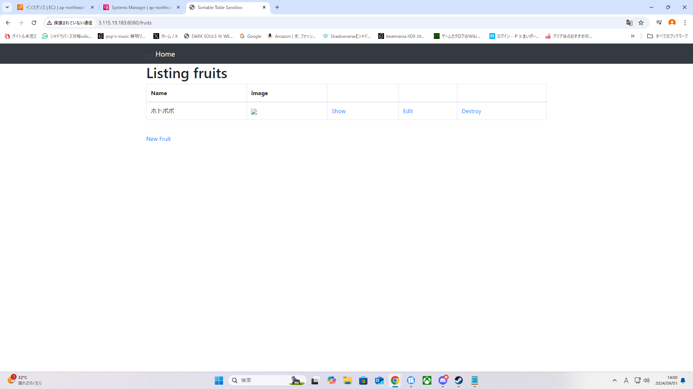
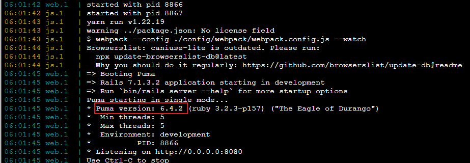
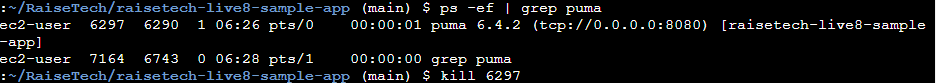
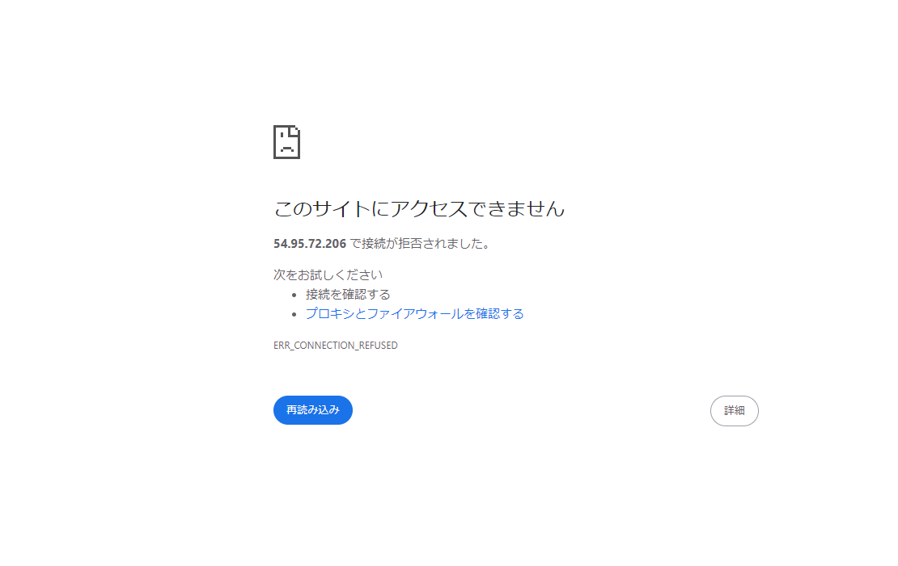
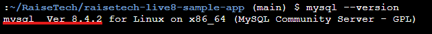
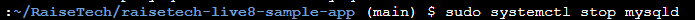
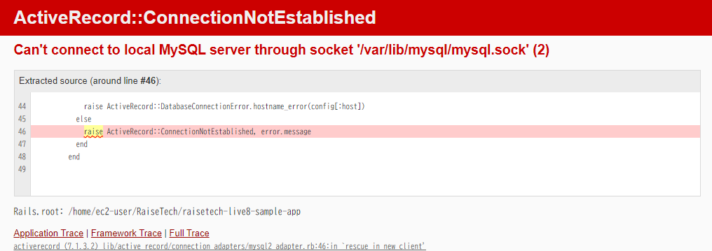

# 第3課題
## webサーバーにつながった状態

## APサーバーの名前とバージョン
- puma 6.4.2

## APサーバー終了とアクセス
- 停止コマンドを打つことで停止させる

- 停止状態でアクセスすると下記エラーが出て接続できなかった

## DBサーバーの名前とバージョン
- mysql 8.4.2

## DBサーバー終了とアクセス
- 停止コマンドを打つことで停止させる

- 停止状態でアクセスすると下記エラーが出て接続できなかった

## Rails の構成管理ツールの名前
- bundler

## 今回の課題から学んだこと
- rubyの構築の作成や、webアプリケーション作成の仕方をなんとなくだが学べた
- CLIの基礎をインベーダー利用で学びある程度理解することができた
- あまり理解していなかった、プルリクエストの一連の流れを理解、コミットしたデータの削除の仕方
- わからないことがあった時の、質問の書き方と考え方
などなど、いろいろと学べた

- 今回はcloud9が生成できないアカウントだったこともあり、寄り道が多くとても大変だったがその分いろいろと勉強になった。　臨機応変に対応する力が少しはついたかなと思う
- 個人的にはmarkdownがある程度きれいに書けたのが楽しかったです！
