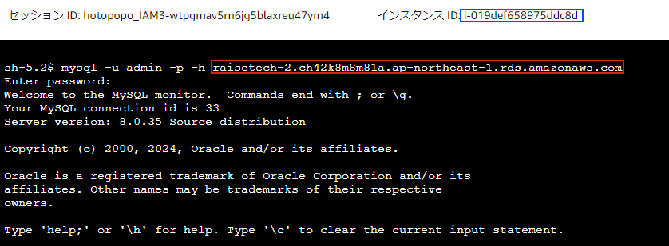
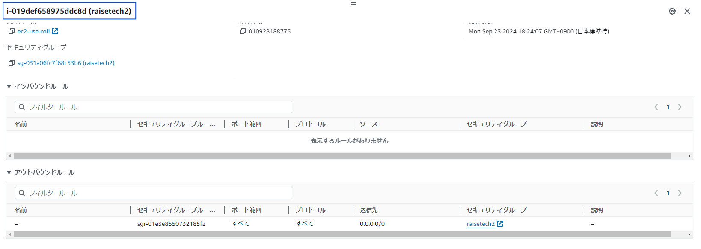
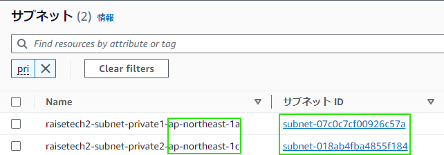

# 第4課題
## 接続成功画面
- ec2からrdsに接続し、成功した画面

- 今回使用したec2のID（青枠で囲んでいる所）

- 今回使用したrdsのエンドポイント（赤枠で囲んでいる所）

## セキュリティグループの設定
- ec2のセキュリティグループの設定

- rdsのセキュリティグループの設定

- rdsのサブネットグループがプライベートになっているエビデンス

## 今回の課題から学んだこと
- 今回はrdsのセキュリティグループのアウトグループを勘違いで設定なしにして手間取ってしまったが、その分AWSサービスの理解が深まった
- IPアドレスの数字の意味やいろいろな送受信の仕組み、bitの単位の意味も知らないレベルだったが、作業をする中でいろいろと知れてとても勉強になった。　このあたりの知識は実生活に近い部分も多くて楽しかった
